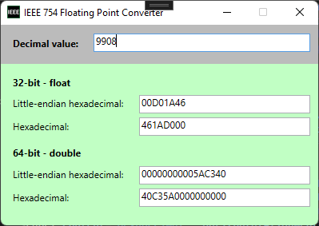

# IEEE 754 Floating Point Converter (Windows)

The simple GUI tool for converting decimal to IEEE 754. Written in C#

Alternatives

- https://baseconvert.com/ieee-754-floating-point
- https://www.h-schmidt.net/FloatConverter/IEEE754.html